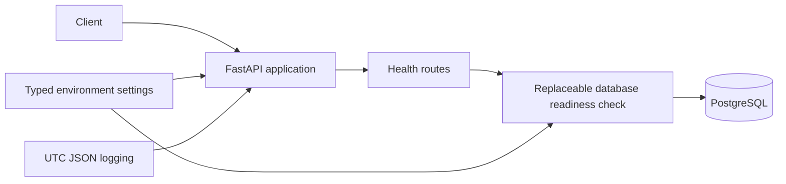

# Architecture

## Current system

The implemented system is a local modular-monolith foundation. It exposes health endpoints, centralizes typed configuration and structured logging, and owns a PostgreSQL/Alembic database boundary. It contains no racing domain, provider, EV, model, or frontend implementation.

## Why a modular monolith

The product is early, data access is unresolved, and domain boundaries will evolve. One deployable application keeps local setup, transactions, testing, and debugging simple while retaining explicit packages that can later be separated only if measured operational needs justify it.

## Package boundaries

- `ev_scanner.api`: FastAPI factory, routes, and Pydantic transport schemas.
- `ev_scanner.core`: settings, typed errors, structured logging, and redaction.
- `ev_scanner.db`: SQLAlchemy declarative base, lazy engine/session creation, readiness query, and Alembic ownership.

Future domain, provider, calculation, explanation, and model packages must not be placed in HTTP handlers.

## API composition

`create_app()` is the public application factory. It configures logging, stores resolved settings in application state, registers routes, and installs sanitized exception handlers. Application construction performs no database connection.

## Configuration flow

`Settings` is the only canonical environment reader. Variables use the `EV_` prefix and may be loaded from `.env` for local development. The database URL is represented as a secret and must never be logged. Invalid log levels, ports, or IANA timezones fail validation early.

## Database and sessions

The SQLAlchemy engine and session factory are lazy cached factories. Importing modules or creating the FastAPI application does not open a connection. Readiness executes `SELECT 1`. Application schema creation through `Base.metadata.create_all` is prohibited.

## Migration strategy

Alembic is the sole schema-management mechanism. Revision `0001_bootstrap` establishes the migration baseline and intentionally creates no application tables. Future domain changes require reviewed migrations with safe downgrade behaviour.

## Health semantics

- `/health/live`: process and HTTP application are alive; no infrastructure access.
- `/health/ready`: PostgreSQL accepts a minimal query. Failure returns a sanitized HTTP 503 without a raw exception or database URL.

## Logging

Application logs are compact JSON records containing UTC timestamp, level, logger, and message. Common database credentials and secret assignments are redacted. Complete provider payloads must not be logged by default in future work.

## Security assumptions

The service binds to localhost in supplied local configuration. No account system, remote deployment, external provider, telemetry, or automatic betting exists. Local development credentials are placeholders and must be replaced outside source control for any non-local environment.

## Decimal and datetime policy

Future odds, stakes, monetary values, financially relevant probabilities, and EV calculations use `Decimal` with documented rounding. Binary floating point is prohibited for those values. System timestamps are aware UTC; presentation timezone is configurable and defaults to `Australia/Sydney`.

## Future provider boundary and provenance

Every provider will require an adapter that maps provider payloads into typed internal models. Provider IDs remain provider-scoped. Future records must retain source and ingestion timestamps, immutable source reference, adapter/schema versions, transformation lineage, and data-quality status. Raw dictionaries cannot escape adapters.

## Decisions

- Python 3.12, FastAPI, Pydantic v2, SQLAlchemy 2, Psycopg 3, Alembic, PostgreSQL.
- Synchronous database foundation until a measured need justifies asynchronous complexity.
- Standard-library JSON logging rather than an additional logging dependency.
- Dependency injection for readiness testing.
- No repository-pattern abstraction before a real domain use case exists.

## Explicitly deferred

Racing entities, live providers, scraping, Betfair/bookmaker integrations, odds and EV mathematics, entity matching, historical snapshots, workers, Redis, frontend, authentication, paper trading, backtesting, statistical models, LLM explanations, and automatic betting are not implemented.

## Next milestone

Phase 2 should implement canonical racing domain and provenance models without adding live providers or EV calculations.
